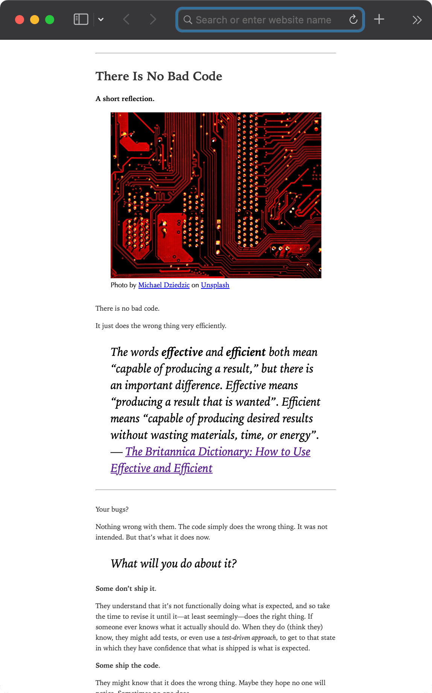

# Medium Exfiltrator 🥷

## Helps you clean up exported Medium posts into a nicer format, ready for use on your own blog or for backup purposes

Whether you want to keep backups, maintain your blog on the side of Medium, or even leave Medium altogether, this tool will help you.

Features:

- Reformat posts:
  - Comes with improved, mobile-optimized CSS...
  - ...or replace the styling with your own CSS!
  - Remove all extraneous tag attributes, such as `data-`, `name`, IDs, and classes
  - Strip away the footer
  - Include or exclude drafts
- Get all used images and use local image URLs instead of Medium's URLs
- Also:
  - Zero dependencies
  - High test coverage

Here's a zoomed-out example of how a post could look:



## Prerequisites and good-to-know

You need to first [export your Medium data, including posts](https://help.medium.com/hc/en-us/articles/115004745787-Export-your-account-data), which is a prerequisite for this tool to do anything.

Note that _it will not_ retrieve any articles—it will only reformat the posts you provide it with. However, if you choose to, you can opt into downloading all images from the posts—this is the _only_ thing where this tool makes any outbound calls to Medium.

## Installation

Run `npm install`.

## Usage

```ts
import { MediumExfiltrator, MediumExfiltratorConfiguration } from 'medium-exfiltrator';

// Your own CSS you want to inject
// Medium Exfiltrator already comes with some improved default CSS
const css = `
h1 {
  font-size: 12rem;
}`

const config: MediumExfiltratorConfiguration = {
  // Required
  contentDirectory: 'posts',
  outputDirectory: 'posts-reformated',

  // Optional
  css,
  removeFooter: true,      // Default: false
  useOriginalHtml: false,  // Default: false
  useLocalImages: true,    // Default: false
  includeDrafts: false,    // Default: false
};

// Create instance
const exfil = new MediumExfiltrator(config);
// Run it
exfil.exfiltrate();
```

Note that if you want to retain the exact same styling and HTML as the original Medium post, then you need to set `useOriginalHtml: true`.
